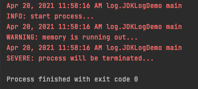
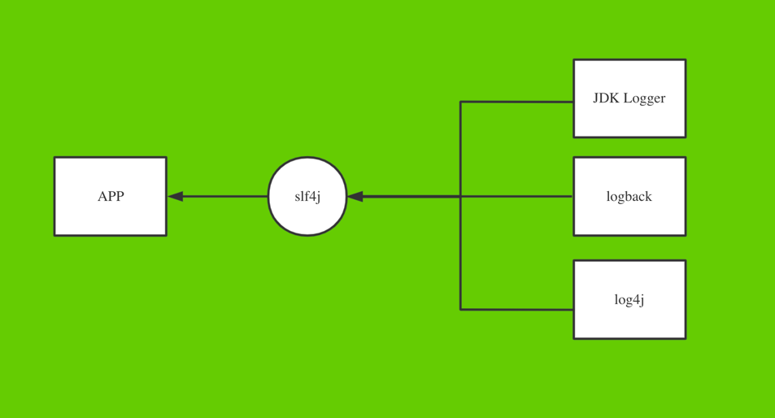

- [ leetcode](#leetcode)
    - [反射](#反射)
        - [动态代理](#动态代理)
    - [注解](#注解)
        - [三类注解](#三类注解)
        - [元注解](#元注解)
        - [处理注解（反射）](#处理注解反射)
    - [多线程](#多线程)
        - [概念](#概念)
        - [创建](#创建)
        - [生命周期](#生命周期)
        - [同步](#同步)
        - [通信](#通信)

# leetcode

## 反射

在程序运行期间，获得类的全部信息。

例子：通用的copy array的方法，在初始化数组的时候不知道数组内容的类型，可以用反射来获取。如果初始使用new Object[ ]，会导致不能强转到其他类型数组，比如Student[ ].

### 动态代理

java三种代理模式

代理模式:   设置一个中间代理来控制访问原目标对象，以达到增强原对象的功能和简化访问方式。

1. **静态代理**

2. **动态代理**(**JDK代理**，**借口代理**)

   ```java
   package basicKnowledge.dynamicProxy;
   import java.lang.reflect.InvocationHandler;
   import java.lang.reflect.Method;
   import java.lang.reflect.Proxy;
   
   /*
   * JDK 动态代理
   * */
   public class dynamicProxyUsingJDK {
       public static void main(String[] args) {
           UserImpl user = new UserImpl();
   
           User proxyInstance = (User)Proxy.newProxyInstance(user.getClass().getClassLoader(), user.getClass().getInterfaces(), new InvocationHandler() {
               @Override
               public Object invoke(Object proxy, Method method, Object[] args) throws Throwable {
                   System.out.println("enhance1 ..................");
                   method.invoke(user, args);
                   System.out.println("enhance2 ..................");
                   return null;
               }
           });
   
           proxyInstance.hello();
       }
   }
   
   interface User {
       void hello();
   }
   
   class UserImpl implements User {
   
       @Override
       public void hello() {
           System.out.println("hello user ..............");
       }
   }
   ```

3. **cglib代理**

   cglib使用字节码处理框架ASM，来转换字节码并生成新的类。被许多AOP的框架使用，例如Spring AOP和dynaop，为他们提供方法的interception（拦截）。

   cglib与动态代理最大的**区别**就是

    - 使用动态代理的对象必须实现一个或多个接口

    - 使用cglib代理的对象则无需实现接口，达到代理类无侵入

   ```java
   package basicKnowledge.dynamicProxy;
   import net.sf.cglib.proxy.Enhancer;
   import net.sf.cglib.proxy.MethodInterceptor;
   import net.sf.cglib.proxy.MethodProxy;
   import java.lang.reflect.Method;
   
   public class ProxyFactory implements MethodInterceptor {
   
       private final Object target;//维护一个目标对象
       public ProxyFactory(Object target) {
           this.target = target;
       }
       
       //为目标对象生成代理对象
       public Object getProxyInstance() {
           //工具类
           Enhancer en = new Enhancer();
           //设置父类
           en.setSuperclass(target.getClass());
           //设置回调函数
           en.setCallback(this);
           //创建子类对象代理
           return en.create();
       }
       
       @Override
       public Object intercept(Object o, Method method, Object[] args, MethodProxy methodProxy) throws Throwable {
           System.out.println("enhance1 ..................");
           method.invoke(target, args);
           System.out.println("enhance2 ..................");
           return null;
       }
   }
   ```

   ```java
     package basicKnowledge.dynamicProxy;
   
     public class dynamicProxyUsingCglib {
         public static void main(String[] args) {
             UserImpl user = new UserImpl();
             ProxyFactory proxyFactory = new ProxyFactory(user);
             UserImpl proxyInstance = (UserImpl)proxyFactory.getProxyInstance();
             proxyInstance.hello();
         }
     }
   ```

## 注解

注解（Annotation）是Java语言用于工具处理的标注.

### 三类注解

- 编译器使用的注解（@Override @SuppressWarnings）

  这类注解不会被编译进入`.class`文件，它们在编译后就被编译器扔掉了

- 编译进``` .class``` 文件，在结束后不存在内存中。

- 程序运行期能够读取的注解，加载后一直存在于JVM中。(@PostConstruct)

### 元注解

可以修饰其他注解的注解。

- @Target

- @Retention

    1. `SOURCE`类型的注解在编译期就被丢掉了；
    2. `CLASS`类型的注解仅保存在class文件中，它们不会被加载进JVM；
    3. `RUNTIME`类型的注解会被加载进JVM，并且在运行期可以被程序读取。

- @Repeatable

- @Documented

- @Inherited

  使用`@Inherited`定义子类是否可继承父类定义的`Annotation`。`@Inherited`仅针对`@Target(ElementType.TYPE)`类型的`annotation`有效，并且仅针对`class`
  的继承，对`interface`的继承无效.

  在使用的时候，如果一个类用到了`@Report`：

  ```java
  @Report(type=1)
  public class Person {
  }
  ```

  则它的子类默认也定义了该注解：

  ```java
  public class Student extends Person {
  }
  ```


**总结**：必须设置`@Target`来指定`Annotation`可以应用的范围；应当设置`@Retention(RetentionPolicy.RUNTIME)`便于运行期读取该`Annotation`。

### 处理注解（反射） ###

对于作用在runtime的注解:

	判断某个注解是否存在:

- `Class.isAnnotationPresent(Class)`

- `Field.isAnnotationPresent(Class)`

- `Method.isAnnotationPresent(Class)`

- `Constructor.isAnnotationPresent(Class)`

  反射API读取Annotation：

- `Class.getAnnotation(Class)`

- `Field.getAnnotation(Class)`

- `Method.getAnnotation(Class)`

- `Constructor.getAnnotation(Class)`

## 多线程 ##

### 创建线程

1. extends Thread

- One is to declare a class to be a subclass of Thread.

- This subclass should override the run method of class Thread.

An instance of the subclass can then be allocated and started.

```java
   class PrimeThread extends Thread {
    long minPrime;

    PrimeThread(long minPrime) {
        this.minPrime = minPrime;
    }

    public void run() {
        // compute primes larger than minPrime
            . . .
    }
}
```

- The following code would then **create a thread** and **start it running**:

``` java
         PrimeThread p = new PrimeThread(143);
         p.start();
```

start()：开启新的线程 + 执行run()方法

2. implement runnable

- Declare a class that implements the Runnable interface.

- That class then implements the run method.

- An instance of the class can then be allocated, passed as an argument when creating Thread, and started.

```java
   class PrimeRun implements Runnable {
    long minPrime;

    PrimeRun(long minPrime) {
        this.minPrime = minPrime;
    }

    public void run() {
        // compute primes larger than minPrime
            . . .
    }
}
```

The following code would then create a thread and start it running:

```java       
			PrimeRun p = new PrimeRun(143);
       new Thread(p).start();
```

优势：

- 没有单继承的局限性
- 共享数据

3. **Implements Callable**(JDK5.0)

    1. 有返回值

    2. 可以抛异常

    3. 支持范型的返回值

    4. 需要借助FutureTask类，比如获取返回结果

```java
      package basicKnowledge.multiThread;

import java.util.concurrent.Callable;
import java.util.concurrent.ExecutionException;
import java.util.concurrent.FutureTask;

public class WindowTicketUsingCallable {
    public static void main(String[] args) {
        WindowCallable windowCallable = new WindowCallable();

        FutureTask<Integer> futureTask = new FutureTask<>(windowCallable);

        new Thread(futureTask).start();

        try {
            Integer sum = futureTask.get();
            System.out.println("sum = " + sum);
        } catch (InterruptedException | ExecutionException e) {
            e.printStackTrace();
        }
    }
}

class WindowCallable implements Callable<Integer> {
    private int ticketNumber = 100;

    @Override
    public Integer call() {
        int sum = 0;
        while (ticketNumber > 0) {
            ticketNumber--;
            sum += 2;
        }
        return sum;
    }
}
```

4. 线程池(JDK5.0)

    1. 提高响应速度（减少创建线程的时间）
    2. 降低资源消耗（重复利用线程池中的线程，避免每次都创建线程）
    3. 便于线程管理

### Method

- *yield* 释放当前CPU执行权
- *join*  在线程a中调用线程b.join()，a进入阻塞状态，b执行完后，a才结束阻塞状态
- sleep

### 生命周期   

### 同步

解决**安全问题**(操作共享数据引起)。

- 同步代码块

```java
synchronized(同步监视器){
        //需要被同步的代码---操作共享数据的代码
        //多个线程共同操作的数据
        }
```

同步监视器：锁. 任何一个类的对象，都可以充当锁. 多个线程必须共用一把锁

```java
  //存在线程安全问题，重票
private static int ticket=100;

@Override
public void run(){
        while(true){
synchronized (Window.class){
        if(ticket<=0){
        break;
        }
        try{
        Thread.sleep(100);
        }catch(InterruptedException e){
        e.printStackTrace();
        }
        System.out.println("window---"+getName()+"---ticket: "+ticket--);
        }
        }
        }
```

*Window.class 是Class的对象*, 并且只会加载一次。

- 同步方法

  同步监视器：非静态方法---```this```；静态方法---当前类``` xxx.class```

```java
class WindowRunnable implements Runnable {
    private int ticket = 100;

    @Override
    public void run() {
        while (true) {
            if (saleTicket()) break;
        }
    }

    //同步监视器：this
    private synchronized boolean saleTicket() {
        if (ticket > 0) {
            try {
                Thread.sleep(100);
            } catch (InterruptedException e) {
                e.printStackTrace();
            }
            System.out.println("window---" + Thread.currentThread().getName() + "---ticket: " + ticket--);
        } else {
            return true;
        }
        return false;
    }
}
```

```java
class Window extends Thread {
    //存在线程安全问题，重票
    private static int ticket = 100;

    @Override
    public void run() {
        while (true) {
            if (saleTicket()) break;
        }
    }

    private static synchronized boolean saleTicket() { //同步监视器: this 加了static后，同步监视器变成: Window.class
        if (ticket <= 0) {
            return true;
        }
        try {
            Thread.sleep(10);
        } catch (InterruptedException e) {
            e.printStackTrace();
        }
        System.out.println("window---" + Thread.currentThread().getName() + "---ticket: " + ticket--);
        return false;
    }
}
```

- LOCK

```java
class WindowRunnable1 implements Runnable {
    private int ticket = 100;
    Lock lock = new ReentrantLock();

    @Override
    public void run() {
        while (true) {
            try {
                lock.lock();

                if (ticket > 0) {
                    try {
                        Thread.sleep(100);
                    } catch (InterruptedException e) {
                        e.printStackTrace();
                    }
                    System.out.println("window---" + Thread.currentThread().getName() + "---ticket: " + ticket--);
                } else {
                    break;
                }
            } finally {
                lock.unlock();
            }
        }
    }
}
```

**对比 syncronized和Lock**：

Lock是显示锁，syncronized是隐示锁，出了作用域自动释放。

Lock只能用在代码块，syncronized可以用在代码块和方法。

### 通信

```java
public final native void wait(long timeoutMillis)throws InterruptedException; //当前线程进入阻塞状态，释放同步监视器。
public final native void notify(); //唤醒wait的一个线程，优先唤醒优先级高的线程。
public final native void notifyAll(); //唤醒所有被wait的线程。
```

*都是native方法，不用Thread.currentThread().wait()，方法调用者必须是被使用的同步监视器，否则会报错：``` IllegalMonitorStateException```
这三个方法必须使用在 同步代码块/同步方法。Lock不适用这三个方法。*

- 两个线程交替打印1-100的数字。

```java
class PrintNumber implements Runnable {
    private int number = 1;

    @Override
    public void run() {

        while (true) {
            synchronized (this) {
                notify();
                if (number <= 100) {
                    System.out.println(Thread.currentThread().getName() + "------" + number);
                    number++;

                    try {
                        wait();
                    } catch (InterruptedException e) {
                        e.printStackTrace();
                    }
                } else {
                    break;
                }
            }
        }
    }
}
```

- **🤔sleep() VS wait()**

  **相同点**：都会让线程进入阻塞状态

  **不同点**：

    1. 声明位置不同，Thread中声明sleep()，Object中声明wait()
    2. 调用场景不同，```sleep()```在任何场景下调用，```wait()```必须在同步代码块/同步方法中调用
    3. 是否释放同步监视器：如果两个方法都使用在同步代码块/同步方法中，```sleep()```不释放同步监视器，```wait()```释放同步监视器。

## 日志

日志就是Logging，它的目的是为了取代`System.out.println()`。

输出日志，而不是用`System.out.println()`，有以下几个好处：

1. 可以设置输出样式，避免自己每次都写`"ERROR: " + var`；
2. 可以设置输出级别，禁止某些级别输出。例如，只输出错误日志；
3. 可以被重定向到文件，这样可以在程序运行结束后查看日志；
4. 可以按包名控制日志级别，只输出某些包打的日志；

### JDK Logger

  ```java
  private static final Level[]standardLevels={
        OFF,SEVERE,WARNING,INFO,CONFIG,FINE,FINER,FINEST,ALL
        }
  ```

默认级别是INFO,INFO以下的日志不会被打印。

  ```java
  import java.util.logging.Level;
import java.util.logging.Logger;

public class JDKLogDemo {
    public static void main(String[] args) {
        Logger logger = Logger.getGlobal();
        //        Logger logger = Logger.getLogger("test name");
        //        Logger logger = Logger.getLogger(JDKLogDemo.class.getName());

        //        Handler console = new ConsoleHandler();
        //        console.setLevel(Level.FINEST);
        //        logger.addHandler(console);

        logger.setLevel(Level.FINEST);

        logger.severe("process will be terminated...");
        logger.warning("memory is running out...");
        logger.info("start process...");
        logger.fine("ignored.");
        logger.finest("finest msg");
    }
}
  ```



### log4j

### logback

### Commons Logging(抽象，门面接口)

一个第三方提供的库(门面接口)

  ```java
  package log;

import org.apache.commons.logging.Log;
import org.apache.commons.logging.LogFactory;

public class CommonsLoggingDemo {
    public static void main(String[] args) {
        Log log = LogFactory.getLog(CommonsLoggingDemo.class);

        log.debug("debug msg");
        log.info("info msg");
        log.warn("warn msg");
        log.fatal("fatal msg");
    }
}
  ```

### SLF4J(抽象，门面接口) *

Simple Logging Facade for Java (abbreviated SLF4J) – acts as a [facade](https://en.wikipedia.org/wiki/Facade_pattern)
for different logging frameworks (e.g. [java.util.logging, logback, Log4j](https://www.baeldung.com/java-logging-intro))
. It offers a generic API making the logging independent of the actual implementation.

This allows for different logging frameworks to coexist. It also helps migrate from one framework to another.

***Introduction to SLF4J:  www.baeldung.com/slf4j-with-log4j2-logback***



- slf4j + logback

  ```java
  import org.slf4j.Logger;
import org.slf4j.LoggerFactory;

/*
 * slf4j + logback
 * logback.xml
 * */
public class Slf4jDemo {
    public static void main(String[] args) {
        Logger logger = LoggerFactory.getLogger(Slf4jDemo.class);

        logger.trace("trace");
        logger.debug("debug");
        logger.info("info");
        logger.warn("warn");
        logger.error("error {}", "AnyParams");
    }
}
  ```

  ```xml

<dependency>
    <groupId>org.slf4j</groupId>
    <artifactId>slf4j-api</artifactId>
    <version>1.7.30</version>
</dependency>
<dependency>
<groupId>ch.qos.logback</groupId>
<artifactId>logback-classic</artifactId>
<version>1.2.3</version>
</dependency>
  ```

logback.xml

  ```xml
  <?xml version="1.0" encoding="UTF-8"?>
<configuration scan="true" scanPeriod="60 seconds" debug="false">
    <contextName>projectName</contextName>
    <property name="contextName" value="projectName"/>
    <property name="log_dir" value="./logs/"/>
    <!--输出到控制台-->
    <appender name="console" class="ch.qos.logback.core.ConsoleAppender">
        <!-- 级别过滤器。如果日志级别低于WARN，将被过滤掉。 ALL TRACE DEBUG INFO WARN ERROR-->
        <filter class="ch.qos.logback.classic.filter.ThresholdFilter">
            <level>DEBUG</level>
        </filter>
        <encoder>
            <pattern>%d{yyyy-MM-dd HH:mm:ss.SSS} %-5level %msg - %file:%line%n</pattern>
            <charset>UTF-8</charset>
        </encoder>
    </appender>

    <!-- 每天记录info级别日志文件 -->
    <appender name="InfoRollingFileAppender"
              class="ch.qos.logback.core.rolling.RollingFileAppender">
        <Prudent>true</Prudent>
        <layout class="ch.qos.logback.classic.PatternLayout">
            <Pattern>%d{yyyy-MM-dd HH:mm:ss} %-5level %msg - %file:%line%n</Pattern>
        </layout>
        <rollingPolicy class="ch.qos.logback.core.rolling.TimeBasedRollingPolicy">
            <FileNamePattern>${log_dir}/${contextName}_info%d{yyyy-MM-dd}.log
            </FileNamePattern>
        </rollingPolicy>
        <!-- 级别过滤器。如果日志级别低于WARN，将被过滤掉。ALL TRACE DEBUG INFO WARN ERROR-->
        <filter class="ch.qos.logback.classic.filter.ThresholdFilter">
            <level>INFO</level>
        </filter>
        <!-- 除了DEBUG级别的日志，其它什么级别的日志都不要 -->
        <!-- <filter class="ch.qos.logback.classic.filter.LevelFilter">
            <level>DEBUG</level>
            <level>INFO</level>
            <onMatch>ACCEPT</onMatch>
            <onMismatch>DENY </onMismatch>
        </filter> -->
    </appender>

    <!-- 每天记录ERROR级别日志文件 -->
    <appender name="ErrorRollingFileAppender"
              class="ch.qos.logback.core.rolling.RollingFileAppender">
        <Prudent>true</Prudent>
        <layout class="ch.qos.logback.classic.PatternLayout">
            <Pattern>%d{yyyy-MM-dd HH:mm:ss} %-5level %msg - %file:%line%n</Pattern>
        </layout>
        <rollingPolicy class="ch.qos.logback.core.rolling.TimeBasedRollingPolicy">
            <FileNamePattern>${log_dir}/${contextName}_error%d{yyyy-MM-dd}.log
            </FileNamePattern>
        </rollingPolicy>
        <!-- 级别过滤器。如果日志级别低于WARN，将被过滤掉。 -->
        <filter class="ch.qos.logback.classic.filter.ThresholdFilter">
            <level>ERROR</level>
        </filter>
        <!-- 除了DEBUG级别的日志，其它什么级别的日志都不要 -->
        <!-- <filter class="ch.qos.logback.classic.filter.LevelFilter">
            <level>DEBUG</level>
            <level>INFO</level>
            <onMatch>ACCEPT</onMatch>
            <onMismatch>DENY </onMismatch>
        </filter> -->
    </appender>

    <root>
        <appender-ref ref="console"/>
        <appender-ref ref="InfoRollingFileAppender"/>
        <appender-ref ref="ErrorRollingFileAppender"/>
    </root>
</configuration>
  ```

# 经验总结

## @GetMapping & @RequestBody

在实际项目中```@GetMapping```方法和```@RequestBody``` 一起使用会出错，建议使用```@PutMapping```+```@RequestBody```
，但是在自己的测试程序中，用postMan测试，是可以用```@GetMapping``` 和```@RequestBody```的组合。

